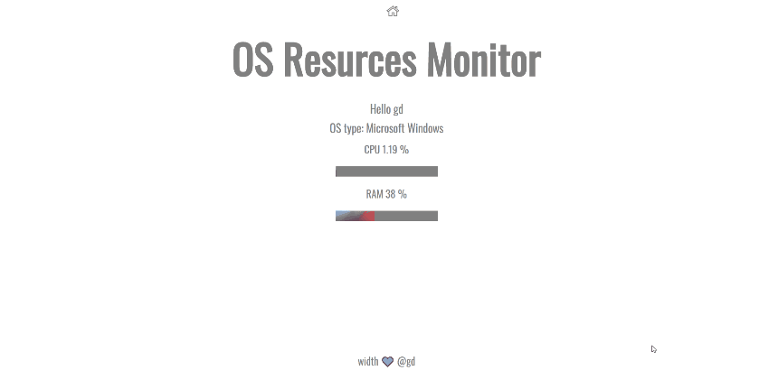

## ⚙️ CPU RAM SYSTEM RESOURCES MONITOR

## 🥞 Tech Stack
[NodeJs](https://nodejs.org/en/)
[Ejs](https://ejs.co/)
[Socket.io](https://socket.io/)



## Installation
Download files, you need to have [NodeJs](https://nodejs.org/en/) installed in your environment.
Open a terminal inside the program folder, to install node modules use this command:
```
npm i
```
## Start
To start the application use this command:

```
npm start
```

Open [Chrome](https://www.google.com/intl/en/chrome/) browser, go to [localhost:3001](http://localhost:3001).

### License
[MIT](https://choosealicense.com/licenses/mit/)

##### with ❤️ @lexpaper